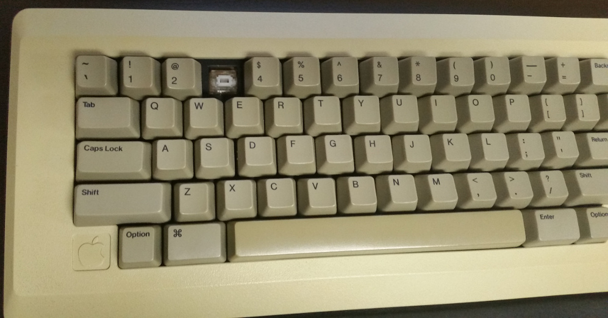
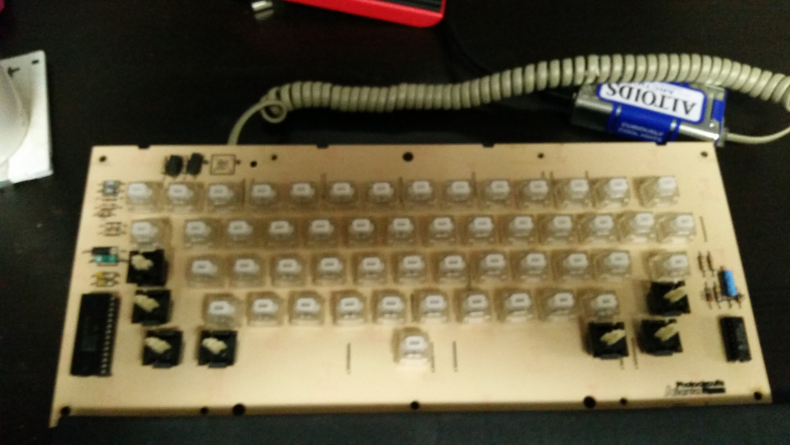
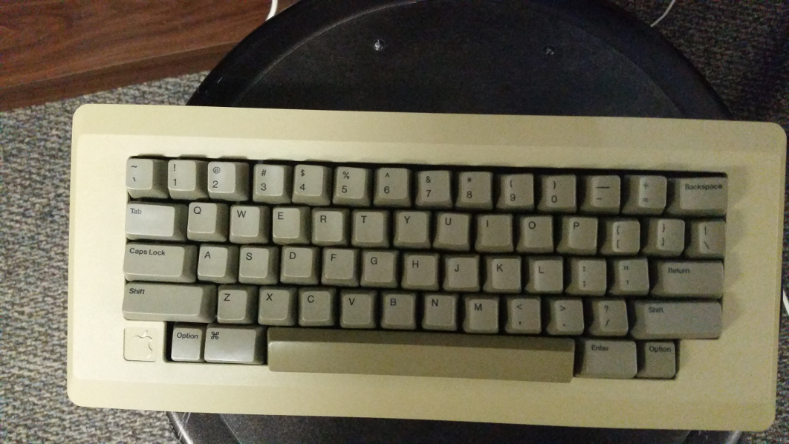
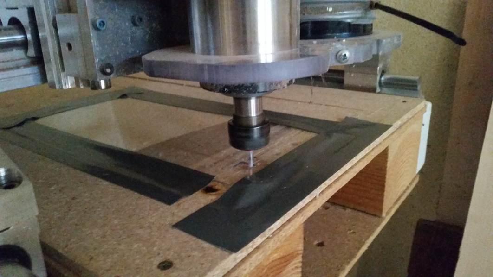
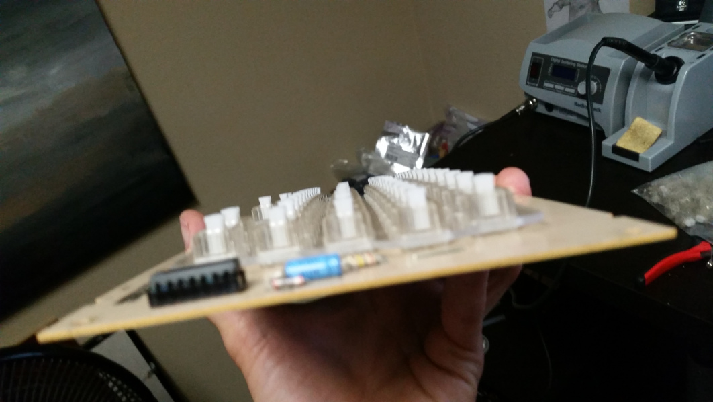
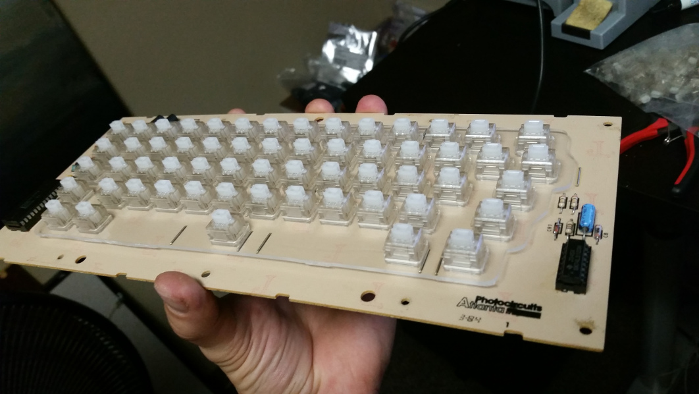
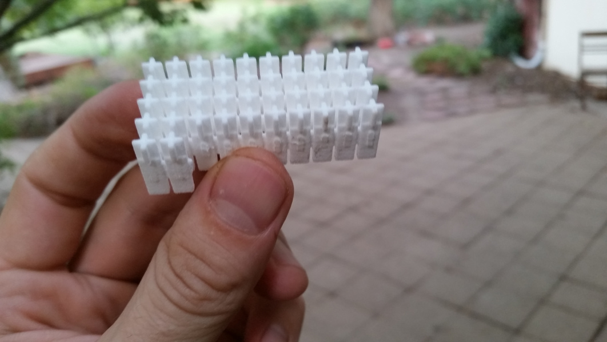
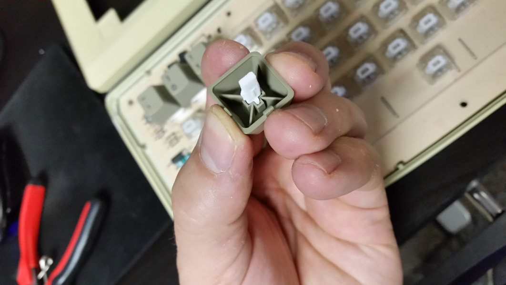
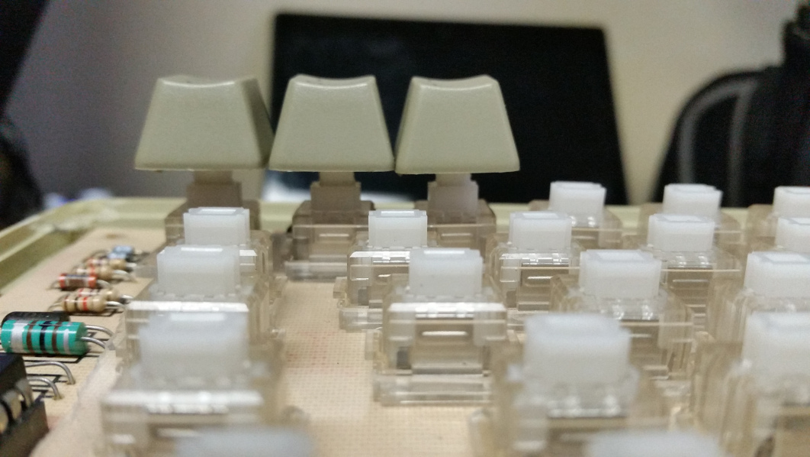
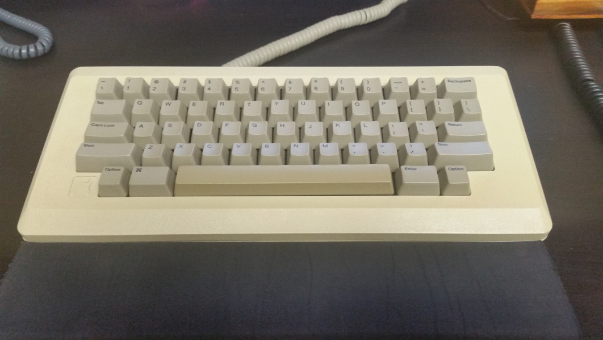

# Apple m0110 Keyboard - Matias Switch Mod

How I modified the Apple m0110 to use [Matias switches](http://matias.ca/switches/click/):

Final picture first:

First off, DO NOT try to solder the switches without a new plate to hold them straight, otherwise it comes out crooked. Also, do not try to use [wooden coffee stirrers](http://www.amazon.com/Royal-Count-Coffee-Beverage-Stirrers/dp/B001FVPAOE) as adapters between the original keycaps and the new switches. :)

Look closely at those crooked teeth:

I ended up CNCing a plexiglass plate that held the new switches into place. Here's the [DFX](resources/m0110_matias_switch_plate.dxf) of the plate I made. Much better.

Since the stir sticks were a bust, I ended up making a 3D model of an adapter between the matias switch and the original keycap. It compensates for the height difference between the switches too.

Here's the file on [shapeways](http://shpws.me/JIun).

Here is the [single model](resources/matias_to_vintage_tee_adapter.stl).

Here are what the adapters look like from shapeways.

There was one final problem that I did not take any pictures of. The matias switches sit about 1mm towards the bottom of the case (Y axis, not Z) than they should. This made the top keys sit a bit away from the cover, and the bottom keys rub and stick. It was a minimal enough change though. Using a dremel tool, I shaved a bit off the top of the motherboard, which allowed me to push it up a bit higher. I also drilled the screw holes in the motherboard a bit bigger. Then, when screwing it together I applied pressure on the motherboard forcing it where I wanted it to go, and then tightened the screws.

If I were to do it again, I would compensate for the difference in the adapter.

The end result:

